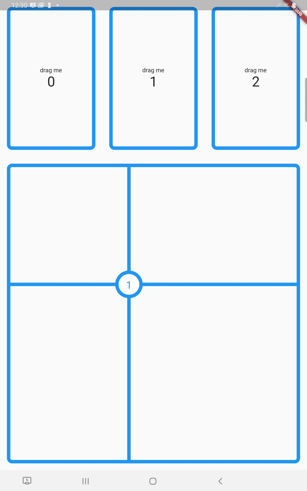

# Know where you drag & drop!

This project demonstrates the use of the new, in Flutter 1.20, `onAcceptWithDetails` callback on `DragTarget`. It enables you to determine the coordinates of the drop.

Before Flutter 1.20, these coordinates were only available from the `Draggable.onDragEnd(details)` callback. Getting the drop coordinates (say, for use in painting in/around your `DragTarget`) was:
* awkward if the `Draggable` did not have the same parent as your `DragTarget`; you would have to store the coordinates somewhere and notify another widget where to find them.
* impossible if the `Draggable` no longer exists when the drop occurs. For example, if a panel containing the `Draggable` animates off-screen before the user drops the feedback widget.

The example shows usage to paint the last drop position on the `DragTarget`.

